# OneGov — Universal Citizen ID & Synthetic Database Simulation Plan

> **Architectural Specification & Synthetic Data Generation Blueprint**  
> *Core Concept: Universal Federated Citizen Reference (`onegov_id`) with Decentralized Departmental Subsystems*

---

## 1. Executive Summary & Architectural Vision

The **OneGov Interoperability Middleware** connects siloed government department databases without creating a centralized surveillance honeypot. 

### The Core Paradigm:
1. **Universal Identifier (`onegov_id`)**: Every citizen receives a unique, synthetic master reference (e.g., `OG-2026-00000001`).
2. **Zero Sensitive Metadata in Master ID**: The `onegov_id` contains **no biometric, financial, or demographic data**. It functions strictly as a cryptographic reference pointer.
3. **Decentralized Departmental Subsystems**: Each department (Tax, Police, Transport, Health, Revenue, Banking, Education, Utilities) maintains its own proprietary identifiers (`SIM-AADHAAR-XXXX`, `SIM-PAN-XXXX`, `SIM-DL-XXXX`, `SIM-BANK-CUST-XXXX`).
4. **Federated Identity Mapping Layer**: OneGov maintains a secure identity-resolution index (`department_identity_mapping`) that correlates departmental identifiers to the citizen's `onegov_id`.
5. **Consent-Gated, Attribute-Level Minimization**: Requesting a citizen's profile **never** dumps their full data lake. The middleware requires explicit purpose-bound consent and returns only the verified categorical attributes permitted by law.

```
                            ┌────────────────────────────────────────┐
                            │        OneGov Interoperability         │
                            │               Middleware               │
                            └───────────────────┬────────────────────┘
                                                │
                                    Universal Citizen ID
                                      OG-2026-00000001
                                                │
    ┌───────────────────┬───────────────────────┼───────────────────────┬───────────────────┐
    ▼                   ▼                       ▼                       ▼                   ▼
┌──────────────┐ ┌──────────────┐       ┌──────────────┐       ┌──────────────┐ ┌──────────────┐
│   Identity   │ │     PAN      │       │     Bank     │       │     RTO      │ │    Police    │
│  Simulation  │ │  Simulation  │       │  Simulation  │       │  Simulation  │ │  Simulation  │
└──────┬───────┘ └──────┬───────┘       └──────┬───────┘       └──────┬───────┘ └──────┬───────┘
       │                │                      │                      │                │
 SIM-AADHAAR-01    SIM-PAN-01             CUSTOMER-01             SIM-DL-01        VERIFY-01
                                               │                      │                │
                                       ┌───────┴───────┐        ┌─────┴─────┐      CASES-01
                                       │  Accounts (2) │        │  Vehicles │
                                       └───────────────┘        └─────┬─────┘
                                                                      │
                                                                   Challans
```

---

## 2. Complete Database Schema Architecture (22 Relational Tables)

The synthetic database is architected for standard PostgreSQL / Supabase deployment with strict relational integrity, indexed search columns, and synthetic data validation.

```mermaid
erDiagram
    onegov_citizens ||--o{ department_identity_mapping : "resolves"
    onegov_citizens ||--o| identity_records : "has"
    onegov_citizens ||--o| pan_records : "has"
    onegov_citizens ||--o{ bank_customers : "owns"
    bank_customers ||--o{ bank_accounts : "holds"
    onegov_citizens ||--o| driving_licences : "holds"
    onegov_citizens ||--o{ vehicles : "registers"
    vehicles ||--o{ traffic_challans : "accrues"
    onegov_citizens ||--o{ police_verifications : "undergoes"
    onegov_citizens ||--o{ police_cases : "involves"
    onegov_citizens ||--o| passports : "holds"
    onegov_citizens ||--o| voter_records : "registered"
    onegov_citizens ||--o{ property_records : "owns"
    onegov_citizens ||--o{ municipal_records : "billed"
    onegov_citizens ||--o{ education_records : "attains"
    onegov_citizens ||--o{ employment_records : "works"
    onegov_citizens ||--o{ business_records : "operates"
    onegov_citizens ||--o{ welfare_records : "applies"
    onegov_citizens ||--o{ pension_records : "receives"
    onegov_citizens ||--o{ utility_records : "connected"
    onegov_citizens ||--o{ insurance_records : "insured"
    onegov_citizens ||--o{ court_records : "litigates"
```



### Table Specifications:

#### 1. `onegov_citizens` (Universal Citizen Registry)
*The root civil identity directory.*
- `onegov_id` (VARCHAR(32), PRIMARY KEY) — `OG-YYYY-XXXXXXXX` (e.g. `OG-2026-00000001`)
- `first_name` (VARCHAR(100), NOT NULL)
- `middle_name` (VARCHAR(100))
- `last_name` (VARCHAR(100), NOT NULL)
- `full_name` (VARCHAR(250), NOT NULL)
- `gender` (VARCHAR(20), NOT NULL) — `MALE`, `FEMALE`, `OTHER`
- `date_of_birth` (DATE, NOT NULL)
- `nationality` (VARCHAR(50), DEFAULT 'INDIAN')
- `marital_status` (VARCHAR(30)) — `SINGLE`, `MARRIED`, `DIVORCED`, `WIDOWED`
- `occupation` (VARCHAR(100))
- `address_line1` (VARCHAR(255), NOT NULL)
- `city` (VARCHAR(100), NOT NULL)
- `district` (VARCHAR(100), NOT NULL)
- `state` (VARCHAR(100), NOT NULL)
- `pincode` (VARCHAR(10), NOT NULL)
- `phone_masked` (VARCHAR(20)) — `+91-XXXXX-98211`
- `email_masked` (VARCHAR(100)) — `r****h@demo.gov.in`
- `citizen_status` (VARCHAR(30), DEFAULT 'ACTIVE') — `ACTIVE`, `DECEASED`, `SUSPENDED`
- `created_at` (TIMESTAMPTZ, DEFAULT NOW())
- `updated_at` (TIMESTAMPTZ, DEFAULT NOW())

#### 2. `department_identity_mapping` (Identity Resolution Hub)
*Resolves OneGov ID to department-specific silo identifiers.*
- `id` (UUID, PRIMARY KEY, DEFAULT gen_random_uuid())
- `onegov_id` (VARCHAR(32), REFERENCES onegov_citizens(onegov_id) ON DELETE CASCADE)
- `department` (VARCHAR(50), NOT NULL) — `AADHAAR_SIM`, `PAN_SIM`, `BANK_SIM`, `DL_SIM`, `RTO_SIM`, `POLICE_SIM`, `PASSPORT_SIM`, `VOTER_SIM`, `PROPERTY_SIM`, `EDUCATION_SIM`, `GST_SIM`, `PENSION_SIM`
- `departmental_identifier` (VARCHAR(100), NOT NULL)
- `identifier_type` (VARCHAR(50), NOT NULL) — `UID_TOKEN`, `PAN_NUMBER`, `CUSTOMER_ID`, `DL_NUMBER`, `EPIC_NUMBER`, `PASSPORT_NO`, `GSTIN`
- `verification_status` (VARCHAR(30), DEFAULT 'VERIFIED') — `VERIFIED`, `UNLINKED`, `FLAGGED`, `PENDING`
- `created_at` (TIMESTAMPTZ, DEFAULT NOW())
- `updated_at` (TIMESTAMPTZ, DEFAULT NOW())
- *Index*: `CREATE INDEX idx_dept_map ON department_identity_mapping(onegov_id, department);`

#### 3. `identity_records` (National Identity / Simulated Aadhaar)
- `id` (UUID, PRIMARY KEY)
- `onegov_id` (VARCHAR(32), REFERENCES onegov_citizens(onegov_id))
- `simulated_aadhaar_id` (VARCHAR(32), UNIQUE, NOT NULL) — `SIM-AADHAAR-XXXXXX`
- `aadhaar_masked` (VARCHAR(20)) — `XXXXXXXX4921`
- `name` (VARCHAR(250), NOT NULL)
- `date_of_birth` (DATE, NOT NULL)
- `gender` (VARCHAR(20), NOT NULL)
- `address` (TEXT, NOT NULL)
- `district` (VARCHAR(100), NOT NULL)
- `state` (VARCHAR(100), NOT NULL)
- `pincode` (VARCHAR(10), NOT NULL)
- `mobile_linked` (BOOLEAN, DEFAULT TRUE)
- `email_linked` (BOOLEAN, DEFAULT TRUE)
- `biometric_status` (VARCHAR(30)) — `LOCKED`, `UNLOCKED`, `EXCEPTION`
- `kyc_status` (VARCHAR(30)) — `ACTIVE`, `SUSPENDED`, `RE_KYC_DUE`
- `verification_status` (VARCHAR(30), DEFAULT 'VERIFIED')

#### 4. `pan_records` (Direct Taxes / Income Tax)
- `id` (UUID, PRIMARY KEY)
- `onegov_id` (VARCHAR(32), REFERENCES onegov_citizens(onegov_id))
- `simulated_pan` (VARCHAR(20), UNIQUE, NOT NULL) — `SIM-PAN-XXXXXX`
- `pan_masked` (VARCHAR(20)) — `ABCPS****F`
- `name` (VARCHAR(250), NOT NULL)
- `date_of_birth` (DATE, NOT NULL)
- `tax_residency` (VARCHAR(50), DEFAULT 'RESIDENT_INDIVIDUAL')
- `income_range` (VARCHAR(50), NOT NULL) — *Sensitive raw figure (e.g. `₹2,40,000 / yr` or `₹14,50,000 / yr`)*
- `income_band` (VARCHAR(20), NOT NULL) — *Minimized category: `LOW` (<3L), `MEDIUM` (3-12L), `HIGH` (>12L)*
- `occupation` (VARCHAR(100))
- `filing_status` (VARCHAR(50)) — `FILED_VERIFIED`, `NON_FILER`, `AUDIT_UNDERWAY`
- `last_filing_year` (VARCHAR(20)) — `AY 2024-25`
- `tax_compliance_status` (VARCHAR(30)) — `COMPLIANT`, `NOTICE_ISSUED`, `DEFICIT`
- `verification_status` (VARCHAR(30), DEFAULT 'VERIFIED')

#### 5. `bank_customers` & `bank_accounts` (Financial Infrastructure)
- `bank_customers`: `(customer_id PK, onegov_id FK, primary_bank_name, kyc_status, customer_since)`
- `bank_accounts`:
  - `account_id` (UUID, PRIMARY KEY)
  - `customer_id` (VARCHAR(50), REFERENCES bank_customers(customer_id))
  - `onegov_id` (VARCHAR(32), REFERENCES onegov_citizens(onegov_id))
  - `bank_name` (VARCHAR(100), NOT NULL) — `State Bank of India`, `HDFC Bank`, `ICICI Bank`, `Punjab National Bank`
  - `account_type` (VARCHAR(30)) — `SAVINGS`, `CURRENT`, `SALARY`, `STUDENT`
  - `account_number_masked` (VARCHAR(30)) — `XXXXXXXX9102`
  - `simulated_ifsc` (VARCHAR(20)) — `SBIN0004921`
  - `branch` (VARCHAR(100))
  - `account_status` (VARCHAR(30)) — `ACTIVE`, `DORMANT`, `FROZEN`
  - `balance_range` (VARCHAR(50)) — *Raw balance range (e.g. `₹15,000 - ₹50,000`)*
  - `balance_threshold_flag` (BOOLEAN) — *Minimized boolean: `hasSufficientBalance`*

#### 6. `driving_licences` (Transport / Motor Vehicles)
- `id` (UUID, PRIMARY KEY)
- `onegov_id` (VARCHAR(32), REFERENCES onegov_citizens(onegov_id))
- `simulated_dl_number` (VARCHAR(50), UNIQUE, NOT NULL) — `SIM-DL-XXXXXX`
- `name` (VARCHAR(250), NOT NULL)
- `date_of_birth` (DATE, NOT NULL)
- `licence_class` (VARCHAR(50)[]) — `['MCWG', 'LMV', 'HMV']`
- `issuing_rto` (VARCHAR(100), NOT NULL) — `KA-01 (Koramangala)`, `DL-04 (Janakpuri)`, `TN-09 (T. Nagar)`
- `issue_date` (DATE, NOT NULL)
- `expiry_date` (DATE, NOT NULL)
- `licence_status` (VARCHAR(30)) — `ACTIVE`, `EXPIRED`, `SUSPENDED`, `REVOKED`
- `verification_status` (VARCHAR(30), DEFAULT 'VERIFIED')

#### 7. `vehicles` & `traffic_challans` (RTO & Traffic Enforcement)
- `vehicles`:
  - `vehicle_id` (VARCHAR(50), PRIMARY KEY) — `SIM-VEH-XXXXXX`
  - `onegov_id` (VARCHAR(32), REFERENCES onegov_citizens(onegov_id))
  - `registration_number` (VARCHAR(30), UNIQUE, NOT NULL) — `KA-01-AB-4921`
  - `manufacturer` (VARCHAR(100)) — `Maruti Suzuki`, `Tata Motors`, `Hyundai`, `Royal Enfield`
  - `model` (VARCHAR(100)) — `Nexon EV`, `Swift Dzire`, `Classic 350`, `Creta`
  - `vehicle_type` (VARCHAR(50)) — `FOUR_WHEELER_NON_TRANSPORT`, `TWO_WHEELER`, `COMMERCIAL_GOODS`
  - `fuel_type` (VARCHAR(30)) — `PETROL`, `DIESEL`, `ELECTRIC`, `CNG`
  - `registration_date` (DATE, NOT NULL)
  - `fitness_expiry` (DATE, NOT NULL)
  - `insurance_status` (VARCHAR(30)) — `ACTIVE_COMPREHENSIVE`, `THIRD_PARTY`, `EXPIRED`
  - `puc_status` (VARCHAR(30)) — `VALID`, `EXPIRED`
  - `rto_code` (VARCHAR(20))
- `traffic_challans`:
  - `challan_id` (VARCHAR(50), PRIMARY KEY) — `SIM-CHALLAN-XXXXXX`
  - `vehicle_id` (VARCHAR(50), REFERENCES vehicles(vehicle_id))
  - `onegov_id` (VARCHAR(32), REFERENCES onegov_citizens(onegov_id))
  - `violation_type` (VARCHAR(100)) — `SPEED_LIMIT_VIOLATION`, `RED_LIGHT_JUMP`, `NO_HELMET`, `WRONG_PARKING`, `PUC_EXPIRED`
  - `violation_date` (TIMESTAMPTZ, NOT NULL)
  - `location` (VARCHAR(200), NOT NULL)
  - `fine_amount` (NUMERIC(10, 2), NOT NULL)
  - `payment_status` (VARCHAR(30)) — `PAID`, `UNPAID`, `CONTESTED`, `REFERRED_TO_LOK_ADALAT`
  - `due_date` (DATE)

#### 8. `police_verifications` & `police_cases` (Law Enforcement)
- `police_verifications`:
  - `verification_id` (VARCHAR(50), PRIMARY KEY) — `SIM-POL-VER-XXXXXX`
  - `onegov_id` (VARCHAR(32), REFERENCES onegov_citizens(onegov_id))
  - `police_station` (VARCHAR(150), NOT NULL)
  - `district` (VARCHAR(100), NOT NULL)
  - `state` (VARCHAR(100), NOT NULL)
  - `verification_purpose` (VARCHAR(100)) — `PASSPORT_ISSUANCE`, `GOVT_EMPLOYMENT`, `TENANT_VERIFICATION`
  - `verification_date` (DATE, NOT NULL)
  - `identity_verified` (BOOLEAN, DEFAULT TRUE)
  - `address_verified` (BOOLEAN, DEFAULT TRUE)
  - `criminal_record_flag` (BOOLEAN, DEFAULT FALSE)
  - `pending_case_flag` (BOOLEAN, DEFAULT FALSE)
  - `verification_status` (VARCHAR(30)) — `CLEAR`, `PENDING_REVIEW`, `ADVERSE_RECORD`
- `police_cases`:
  - `case_id` (VARCHAR(50), PRIMARY KEY)
  - `onegov_id` (VARCHAR(32), REFERENCES onegov_citizens(onegov_id))
  - `fir_number` (VARCHAR(100), NOT NULL)
  - `police_station` (VARCHAR(150))
  - `sections` (VARCHAR(200)) — `IPC 279 (Rash Driving)`, `IPC 420 (Cheating)`
  - `case_status` (VARCHAR(30)) — `CLOSED_ACQUITTED`, `UNDER_INVESTIGATION`, `CHARGESHEET_FILED`

#### 9. `passports` (Consular & Immigration)
- `simulated_passport_number` (VARCHAR(30), PRIMARY KEY) — `SIM-PASS-XXXXXX`
- `onegov_id` (VARCHAR(32), REFERENCES onegov_citizens(onegov_id))
- `name` (VARCHAR(250), NOT NULL)
- `nationality` (VARCHAR(50), DEFAULT 'INDIAN')
- `passport_type` (VARCHAR(20), DEFAULT 'REGULAR_P')
- `issue_date` (DATE, NOT NULL)
- `expiry_date` (DATE, NOT NULL)
- `passport_status` (VARCHAR(30)) — `ACTIVE`, `EXPIRED`, `CANCELLED_SURRENDERED`
- `police_verification_status` (VARCHAR(30), DEFAULT 'VERIFIED')

#### 10. `voter_records` (Election Commission)
- `simulated_voter_id` (VARCHAR(30), PRIMARY KEY) — `SIM-VOTER-XXXXXX` (EPIC)
- `onegov_id` (VARCHAR(32), REFERENCES onegov_citizens(onegov_id))
- `name` (VARCHAR(250), NOT NULL)
- `assembly_constituency` (VARCHAR(150), NOT NULL)
- `parliamentary_constituency` (VARCHAR(150), NOT NULL)
- `polling_station` (VARCHAR(200), NOT NULL)
- `state` (VARCHAR(100), NOT NULL)
- `district` (VARCHAR(100), NOT NULL)
- `electoral_status` (VARCHAR(30), DEFAULT 'ACTIVE_ENROLLED')

#### 11. `property_records` & `municipal_records` (Land & Urban Local Bodies)
- `property_records`:
  - `property_id` (VARCHAR(50), PRIMARY KEY) — `SIM-PROP-XXXXXX`
  - `onegov_id` (VARCHAR(32), REFERENCES onegov_citizens(onegov_id))
  - `property_reference` (VARCHAR(100), NOT NULL) — `KHATA-A-49210`
  - `property_type` (VARCHAR(50)) — `RESIDENTIAL_APARTMENT`, `INDEPENDENT_HOUSE`, `AGRICULTURAL_LAND`, `COMMERCIAL_UNIT`
  - `ownership_type` (VARCHAR(50)) — `SOLE_OWNER`, `JOINT_OWNERSHIP`
  - `address` (TEXT, NOT NULL)
  - `area_sqft` (NUMERIC(10, 2))
  - `registration_date` (DATE, NOT NULL)
  - `encumbrance_status` (VARCHAR(30)) — `NIL_ENCUMBRANCE`, `MORTGAGED_BANK`, `DISPUTED`
  - `property_status` (VARCHAR(30), DEFAULT 'VERIFIED')
- `municipal_records`:
  - `holding_number` (VARCHAR(50), PRIMARY KEY)
  - `property_id` (VARCHAR(50), REFERENCES property_records(property_id))
  - `onegov_id` (VARCHAR(32), REFERENCES onegov_citizens(onegov_id))
  - `municipal_body` (VARCHAR(150), NOT NULL) — `BBMP (Bengaluru)`, `MCD (Delhi)`, `BMC (Mumbai)`
  - `ward_number` (VARCHAR(50))
  - `property_tax_status` (VARCHAR(30)) — `PAID_CURRENT_YEAR`, `ARREARS_PENDING`
  - `water_connection_status` (VARCHAR(30)) — `ACTIVE`, `DISCONNECTED`
  - `occupancy_certificate_status` (VARCHAR(30)) — `ISSUED_VALID`, `PENDING_CLEARANCE`

#### 12. `education_records` (University Registrars & Academic Boards)
- `education_record_id` (VARCHAR(50), PRIMARY KEY) — `SIM-EDU-XXXXXX`
- `onegov_id` (VARCHAR(32), REFERENCES onegov_citizens(onegov_id))
- `institution` (VARCHAR(200), NOT NULL)
- `board_or_university` (VARCHAR(200), NOT NULL)
- `qualification` (VARCHAR(100), NOT NULL) — `SECONDARY_10TH`, `HIGHER_SECONDARY_12TH`, `BACHELORS`, `MASTERS`, `DOCTORATE`
- `program` (VARCHAR(150)) — `B.Tech Computer Science`, `B.A. Economics`, `MBBS`, `M.Sc Mathematics`
- `enrollment_year` (INT, NOT NULL)
- `graduation_year` (INT)
- `enrollment_status` (VARCHAR(30), NOT NULL) — `ACTIVE`, `GRADUATED`, `DROPPED_OUT`
- `cgpa` (VARCHAR(20)) — `8.92 / 10.0`
- `certificate_reference` (VARCHAR(100))
- `verification_status` (VARCHAR(30), DEFAULT 'VERIFIED')

#### 13. `employment_records` (EPFO / Employment Registries)
- `employment_id` (VARCHAR(50), PRIMARY KEY) — `SIM-EMP-XXXXXX`
- `onegov_id` (VARCHAR(32), REFERENCES onegov_citizens(onegov_id))
- `employer` (VARCHAR(200), NOT NULL)
- `employee_reference` (VARCHAR(100))
- `designation` (VARCHAR(150))
- `employment_type` (VARCHAR(50)) — `FULL_TIME_SALARIED`, `CONTRACT`, `GOVERNMENT_SERVICE`, `SELF_EMPLOYED`
- `joining_date` (DATE, NOT NULL)
- `leaving_date` (DATE)
- `employment_status` (VARCHAR(30)) — `ACTIVE`, `RESIGNED`, `TERMINATED`
- `salary_range` (VARCHAR(50)) — *Sensitive raw range*
- `work_location` (VARCHAR(100))
- `epfo_uan_masked` (VARCHAR(30)) — `XXXXXXXX4921`
- `verification_status` (VARCHAR(30), DEFAULT 'VERIFIED')

#### 14. `business_records` (Ministry of Corporate Affairs / GST)
- `business_id` (VARCHAR(50), PRIMARY KEY) — `SIM-BIZ-XXXXXX`
- `onegov_id` (VARCHAR(32), REFERENCES onegov_citizens(onegov_id))
- `business_name` (VARCHAR(200), NOT NULL)
- `business_type` (VARCHAR(50)) — `PROPRIETORSHIP`, `PRIVATE_LIMITED`, `LLP`, `PARTNERSHIP`
- `registration_number` (VARCHAR(50))
- `simulated_gst_number` (VARCHAR(30), UNIQUE) — `29ABCDE1234F1Z5`
- `registration_date` (DATE, NOT NULL)
- `turnover_range` (VARCHAR(50))
- `gst_status` (VARCHAR(30)) — `ACTIVE_COMPLIANT`, `CANCELLED_NON_FILING`, `SUSPENDED`
- `business_status` (VARCHAR(30), DEFAULT 'ACTIVE')

#### 15. `welfare_records` & `pension_records` (Public Assistance & Social Security)
- `welfare_records`:
  - `application_id` (VARCHAR(50), PRIMARY KEY) — `SIM-WEL-XXXXXX`
  - `onegov_id` (VARCHAR(32), REFERENCES onegov_citizens(onegov_id))
  - `scheme_name` (VARCHAR(200), NOT NULL) — `National Merit Scholarship 2025`, `Pradhan Mantri Awas Yojana`, `PM Kisan Samman Nidhi`, `National Fellowship for Higher Education`
  - `application_number` (VARCHAR(100), UNIQUE)
  - `application_date` (DATE, NOT NULL)
  - `eligibility_status` (VARCHAR(30)) — `ELIGIBLE_CRITERIA_MET`, `INELIGIBLE_INCOME_CEILING`, `INELIGIBLE_ENROLMENT`
  - `application_status` (VARCHAR(30)) — `APPROVED_DISBURSED`, `IN_REVIEW`, `REJECTED`
  - `benefit_amount` (VARCHAR(50)) — `₹75,000 / year`, `₹60,000 one-time`
  - `department` (VARCHAR(100))
  - `approval_date` (DATE)
- `pension_records`:
  - `pension_id` (VARCHAR(50), PRIMARY KEY) — `SIM-PEN-XXXXXX`
  - `onegov_id` (VARCHAR(32), REFERENCES onegov_citizens(onegov_id))
  - `pension_type` (VARCHAR(50)) — `SENIOR_CITIZEN_OLD_AGE`, `DEFENCE_SERVICE`, `EPFO_EPS95`, `DISABILITY_SUPPORT`
  - `eligibility_status` (VARCHAR(30)) — `ACTIVE_BENEFICIARY`, `INELIGIBLE_AGE`
  - `pension_status` (VARCHAR(30)) — `DISBURSING_MONTHLY`, `LIFE_CERTIFICATE_PENDING`, `STOPPED`
  - `contribution_years` (INT)
  - `registration_date` (DATE, NOT NULL)
  - `last_life_certificate_date` (DATE)

#### 16. `utility_records` (Power, Water, Gas Infrastructure)
- `utility_id` (VARCHAR(50), PRIMARY KEY) — `SIM-UTIL-XXXXXX`
- `onegov_id` (VARCHAR(32), REFERENCES onegov_citizens(onegov_id))
- `utility_type` (VARCHAR(30)) — `ELECTRICITY`, `WATER`, `PIPED_NATURAL_GAS`
- `provider` (VARCHAR(150), NOT NULL) — `BESCOM (Bangalore Electricity)`, `Tata Power`, `Indraprastha Gas`, `Delhi Jal Board`
- `account_reference` (VARCHAR(50), NOT NULL)
- `address` (TEXT, NOT NULL)
- `connection_status` (VARCHAR(30)) — `ACTIVE`, `DISCONNECTED_DEFAULT`, `TEMPORARY_SUSPENDED`
- `billing_status` (VARCHAR(30)) — `CURRENT_NO_DUES`, `OVERDUE_PAYMENT_DUE`

#### 17. `insurance_records` (Health & Life Protection)
- `policy_id` (VARCHAR(50), PRIMARY KEY) — `SIM-INS-XXXXXX`
- `onegov_id` (VARCHAR(32), REFERENCES onegov_citizens(onegov_id))
- `provider` (VARCHAR(150), NOT NULL) — `Life Insurance Corporation (LIC)`, `Star Health`, `HDFC ERGO`, `New India Assurance`
- `policy_reference` (VARCHAR(50), NOT NULL)
- `policy_type` (VARCHAR(50)) — `HEALTH_FAMILY_FLOATER`, `TERM_LIFE`, `MOTOR_COMPREHENSIVE`
- `start_date` (DATE, NOT NULL)
- `expiry_date` (DATE, NOT NULL)
- `coverage_range` (VARCHAR(50)) — `₹5,00,000`, `₹1,00,00,000`
- `policy_status` (VARCHAR(30)) — `ACTIVE_IN_FORCE`, `LAPSED`, `CLAIM_IN_PROGRESS`

#### 18. `court_records` (Judiciary / e-Courts Simulation)
- `case_id` (VARCHAR(50), PRIMARY KEY) — `SIM-COURT-XXXXXX`
- `onegov_id` (VARCHAR(32), REFERENCES onegov_citizens(onegov_id))
- `case_reference` (VARCHAR(100), NOT NULL) — `OS/4921/2023`, `CC/1029/2024`
- `court_name` (VARCHAR(200), NOT NULL) — `District Court, Bengaluru Urban`, `High Court of Delhi`, `Chief Metropolitan Magistrate Court`
- `case_category` (VARCHAR(50)) — `CIVIL_PROPERTY_DISPUTE`, `CHEQUE_BOUNCE_NI_138`, `MOTOR_ACCIDENT_CLAIM`, `COMMERCIAL_ARBITRATION`
- `citizen_role` (VARCHAR(30)) — `PETITIONER`, `RESPONDENT`, `DEFENDANT`, `WITNESS`
- `filing_date` (DATE, NOT NULL)
- `case_status` (VARCHAR(30)) — `DISPOSED_IN_FAVOUR`, `PENDING_EVIDENCE`, `STAY_ORDER_ACTIVE`, `DISMISSED`
- `next_hearing_date` (DATE)
- `disposition_status` (VARCHAR(50))

---

## 3. Data Volume & Population Distribution Targets

Target dataset scale for realistic national demo (10,000 core citizens):

| Table | Target Records | Coverage % | Key Realism Constraints |
| :--- | :--- | :--- | :--- |
| `onegov_citizens` | **10,000** | 100% | Full demographic range (age 18–85), 28 Indian States & UTs |
| `department_identity_mapping` | **72,000+** | N/A | Multi-department index linking every citizen to active departmental IDs |
| `identity_records` | **9,500** | 95% | 95% have biometric Aadhaar; 5% exceptions (new enrolments / unlinked) |
| `pan_records` | **8,000** | 80% | Income range correlation with age & occupation |
| `bank_customers` | **7,500** | 75% | 7,500 banked citizens |
| `bank_accounts` | **9,200** | 92% | Multiple accounts for middle/high income citizens (Savings + Salary/Current) |
| `driving_licences` | **6,000** | 60% | Age-gated (18+); vehicle classes (LMV, MCWG, HMV) |
| `vehicles` | **7,000** | 70% | Single & multi-vehicle owners, commercial fleet operators |
| `traffic_challans` | **20,000+** | 200%+ | Violations distributed across vehicles; 85% paid, 15% unpaid defaults |
| `police_verifications` | **9,000** | 90% | 96% CLEAR, 3% PENDING_REVIEW, 1% ADVERSE |
| `police_cases` | **2,000** | 20% | Traffic, minor civil disputes, commercial disputes |
| `passports` | **4,500** | 45% | Correlated with international travellers & salaried professionals |
| `voter_records` | **8,500** | 85% | 18+ eligible voting demographic across constituencies |
| `property_records` | **3,500** | 35% | Urban apartments, rural land, individual plots |
| `municipal_records` | **3,500** | 35% | Property tax, water, and building occupancy compliance |
| `education_records` | **7,000** | 70% | 10th/12th, Bachelors, Masters, PhD across premier universities |
| `employment_records` | **5,500** | 55% | Private sector, government civil servants, startups, self-employed |
| `business_records` | **1,200** | 12% | GSTIN registered entities (Proprietorships, Pvt Ltd, LLPs) |
| `welfare_records` | **2,000** | 20% | Scholarship, housing, farmer, and merit assistance applications |
| `pension_records` | **1,000** | 10% | Senior citizens (age 60+) and defence personnel |
| `utility_records` | **7,000** | 70% | Electricity (BESCOM, Tata Power), Piped Gas, Water connections |
| `insurance_records` | **3,000** | 30% | Health family floater, term life, vehicle insurance |
| `court_records` | **1,000** | 10% | Civil property, NI Act 138, Motor Claims |

---

## 4. Controlled Noise & Realistic Inconsistency Engine (1–3%)

Real-world government interoperability middleware must handle data quality friction. The generation engine will deterministically inject controlled inconsistencies:

```text
┌──────────────────────────────────────────────────────────────────────────────────┐
│                             INCONSISTENCY TAXONOMY                               │
├───────────────────────┬───────────────────────┬──────────────────────────────────┤
│ Department 1 Record   │ Department 2 Record   │ Interoperability Challenge       │
├───────────────────────┼───────────────────────┼──────────────────────────────────┤
│ Identity (Aadhaar):   │ Bank Account:         │ Name Matching & Fuzzy            │
│ "Rahul Kumar Singh"   │ "Rahul K Singh"       │ Resolution Algorithm             │
├───────────────────────┼───────────────────────┼──────────────────────────────────┤
│ Identity (Aadhaar):   │ Transport (RTO):      │ Address Drift (Moved cities      │
│ "Patna, Bihar"        │ "Bengaluru, Karnataka"│ without updating Aadhaar)        │
├───────────────────────┼───────────────────────┼──────────────────────────────────┤
│ Identity (Aadhaar):   │ Tax (PAN):            │ Date of Birth Typo / Leap Day    │
│ "1998-04-17"          │ "1998-04-19"          │ Discrepancy                      │
├───────────────────────┼───────────────────────┼──────────────────────────────────┤
│ Bank Customer:        │ Income Tax:           │ KYC Expiry / Status Freeze       │
│ KYC_RE_KYC_DUE        │ COMPLIANT             │                                  │
├───────────────────────┼───────────────────────┼──────────────────────────────────┤
│ Transport (DL):       │ Police Verification:  │ Expired Document vs Clear        │
│ EXPIRED (2023)        │ CLEAR                 │ Police Status                    │
└───────────────────────┴───────────────────────┴──────────────────────────────────┘
```

---

## 5. Master Catalog of 50 Deterministic Demo Citizens (`OG-2026-00000001` - `00000050`)

Every test scenario, edge case, and presentation script is mapped to a dedicated deterministic citizen:

| OneGov ID | Citizen Name | Core Persona & Demo Purpose | Department Records & State |
| :--- | :--- | :--- | :--- |
| **`OG-2026-00000001`** | **Rahul Kumar Singh** | **Golden Standard (Passes All)** | 100% clean: Active Aadhaar, PAN (Low), Bank (Active), DL (Active), 2 Vehicles (0 Challans), Clear Police, Active Passport, Enrolled NIT Trichy. |
| **`OG-2026-00000002`** | **Priya Sharma** | **Scholarship Approved** | Low income (<3L), Enrolled NIT Trichy B.Tech CSE (8.92 CGPA), DBT Bank Linked, 100% eligible for ₹75,000 grant. |
| **`OG-2026-00000003`** | **Amitabh Joshi** | **Expired Driving Licence** | Age 42, DL expired on 2023-11-15, Active vehicle registration. Fails Transport verification guard. |
| **`OG-2026-00000004`** | **Sneha Patel** | **Challan Defaulter** | Owns 1 car with 7 unpaid traffic challans (₹8,500 total). Fails RTO clean-chit workflow. |
| **`OG-2026-00000005`** | **Mohammed Arif** | **Address & Name Mismatch** | Aadhaar: "Mohammed Arif", Bank: "Md Arif Khan", DL address in Mumbai, Aadhaar address in Hyderabad. Demonstrates fuzzy reconciler. |
| **`OG-2026-00000006`** | **Ananya Deshmukh** | **Police Verification Pending** | Passport applicant with police verification status `PENDING_FIELD_VISIT`. Middleware pauses workflow in `PENDING` state. |
| **`OG-2026-00000007`** | **Vikramaditya Roy** | **Bank Re-KYC Overdue** | High net-worth taxpayer with Bank KYC status `EXPIRED_PENDING_REKYC`. Financial disbursements blocked. |
| **`OG-2026-00000008`** | **Kavita Sundaram** | **Expired Passport** | Passport expired on 2024-02-10. Visa/Immigration verification rejects. |
| **`OG-2026-00000009`** | **Gurpreet Singh** | **Fleet Owner (Multiple Vehicles)** | Owns 6 registered commercial goods vehicles + 1 private car. 14 challans logged. |
| **`OG-2026-00000010`** | **Rajeshwar Hegde** | **Encumbered Property Dispute** | Khata-A property with court stay order `OS/4921/2023`. Property loan/clearance blocked. |
| **`OG-2026-00000011`** | **Sunita Devi** | **Unbanked Rural Citizen** | Has Aadhaar + Voter ID, but zero Bank accounts. Demonstrates Financial Inclusion onboarding flow. |
| **`OG-2026-00000012`** | **Ramesh Chandra** | **Non-Taxpayer (No PAN)** | Farmer eligible for PM-Kisan assistance; no PAN required under agricultural exemption. |
| **`OG-2026-00000013`** | **Divya Nambiar** | **High Income Rejection** | IIT Delhi M.Tech student, but household income is `HIGH` (>12 LPA). Fails need-based scholarship ceiling. |
| **`OG-2026-00000014`** | **Karpagam Swaminathan**| **Senior Citizen Pensioner** | Age 68, Active Old Age Pension recipient, verified Aadhaar life-certificate filed. |
| **`OG-2026-00000015`** | **Harish Mehra** | **Multi-Entity GST Business Owner** | Operates 2 active Pvt Ltd corporations with ₹4.5 Cr turnover. |
| **`OG-2026-00000016`** | **Tenzin Norbu** | **First-Time Housing Subsidy** | Zero prior property records, Low-Medium income, eligible for PMAY ₹60,000 housing grant. |
| **`OG-2026-00000017`** | **Deepak Kulkarni** | **Suspended Driving Licence** | Licence suspended for 6 months due to drunken driving violation under Section 185. |
| **`OG-2026-00000018`** | **Shalini Banerjee** | **Doctoral Fellowship Beneficiary** | Jadavpur University PhD candidate with active ₹42,000/month research stipend. |
| **`OG-2026-00000019`** | **Venkatesh Rao** | **Municipal Tax Arrears** | BBMP property tax unpaid for 3 consecutive years; utility renewal flagged. |
| **`OG-2026-00000020`** | **Meenakshi Iyer** | **High Net-Worth Compliant** | Annual income >₹50 LPA, 3 properties, 2 luxury vehicles, 100% tax compliant. |
| **`OG-2026-00000021` - `00000035`** | *Specialized Personas* | **Mixed Demographic Journeys** | Agricultural loans, Defence pensioners, Minor passport renewals, Start-up founders, Gig economy workers with intermittent EPF. |
| **`OG-2026-00000036` - `00000050`** | *Edge Case Validation* | **Security & Fraud Scenarios** | Multiple active passports (flagged), Duplicate voter registrations, Identity theft victim simulation, Unclaimed bank deposits. |

---

## 6. Implementation Roadmap & Execution Architecture

### Phase 1: High-Throughput TypeScript Synthetic Generator
Build `scripts/generate_synthetic_db.ts`:
- Employs deterministic PRNG (pseudo-random number generator) seeded for reproducibility.
- Generates Indian demographic datasets (names, surnames by state, pin codes, realistic vehicle number formats `[STATE]-[RTO]-[SERIES]-[NUMBER]`, PAN formats `[A-Z]{5}[0-9]{4}[A-Z]`, IFSC codes).
- Implements relationship builders ensuring relational consistency across all 22 tables.
- Emits a clean SQL dump (`seeds/onegov_synthetic_database.sql`) formatted for instant PostgreSQL / Supabase ingestion.

### Phase 2: Supabase / PostgreSQL Direct Ingestion
- Clean DDL schema with optimal indexes.
- Fast `COPY` or batch multi-row `INSERT` statements wrapped in transactions.
- Zero external package dependencies needed to load into PostgreSQL.

### Phase 3: Middleware Connector Integration
- Connect the OneGov backend query engine to the simulated tables:
  ```typescript
  // Resolver querying via Universal OneGov ID
  const map = await db.departmentIdentityMapping.findMany({
    where: { onegovId: 'OG-2026-00000001' }
  });
  ```
- Expose attribute-level consent filtering and cryptographic audit chaining for all 22 departments.
